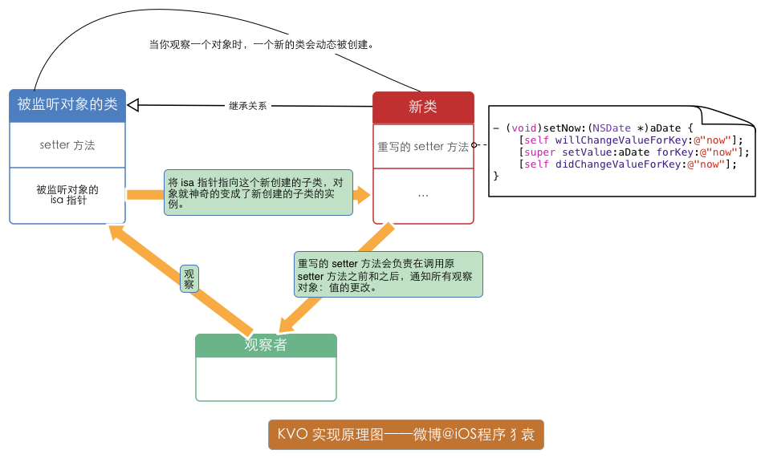

### category 和 extension 的区别
- 分类有名字，类扩展没有分类名字，是一种特殊的分类
- 分类只能扩展方法（属性仅仅是声明，并没真正实现），类扩展可以扩展属性、成员变量和方法

### define 和 const常量有什么区别?
- define在预处理阶段进行替换，const常量在编译阶段使用
- 宏不做类型检查，仅仅进行替换，const常量有数据类型，会执行类型检查
- define不能调试，const常量可以调试
- define定义的常量在替换后运行过程中`会不断地占用内存`，而const定义的常量存储在数据段`只有一份copy`，效率更高
- define可以定义一些简单的函数，const不可以

### __block和__weak修饰符的区别？
- __block不管是ARC还是MRC模式下`都`可以使用，`可以`修饰对象，`也可以`修饰基本数据类型
- __weak`只能`在ARC模式下使用，`只能`修饰对象（NSString），`不能`修饰基本数据类型
- __block修饰的对象可以在block中被重新赋值，__weak修饰的对象不可以

### static关键字的作用
- 函数（方法）体内 static 变量的作用范围为该函数体，该变量的内存只被分配一次，因此其值在下次调用时仍维持上次的值；
- 在模块内的 static 全局变量可以被模块内所用函数访问，但不能被模块外其它函数访问；
- 在模块内的 static 函数只可被这一模块内的其它函数调用，这个函数的使用范围被限制在声明 它的模块内；
- 在类中的 static 成员变量属于整个类所拥有，对类的所有对象只有一份拷贝；
- 在类中的 static 成员函数属于整个类所拥有，这个函数不接收 this 指针，因而只能访问类的static 成员变量

### 堆和栈的区别
- 从管理方式来讲
    - 对于栈来讲，是由编译器自动管理，无需我们手工控制；
    - 对于堆来说，释放工作由程序员控制，容易产生内存泄露(memory leak)
- 从申请大小大小方面讲
    - 栈空间比较小
    - 堆控件比较大
- 从数据存储方面来讲
    - 栈空间中一般存储基本类型，对象的地址
    - 堆空间一般存放对象本身，block的copy等

### 风格纠错题


- 修改后的代码

```objc
typedef NS_ENUM(NSInteger, CYLSex)
{
  CYLSexMan,
  CYLSexWoman
};

@interface CYLUser : NSObject<NSCopying>

@property (nonatomic, copy, readonly) NSString *name;
@property (nonatomic, assign, readonly) NSUInteger age;
@property (nonatomic, assign, readwrite) CYLSex sex;

- (instancetype)initWithName:(NSString *)name age:(NSUInteger)age sex:(CYLSex)sex;
- (instancetype)initWithName:(NSString *)name age:(NSUInteger)age;
+ (instancetype)userWithName:(NSString *)name age:(NSUInteger)age sex:(CYLSex)sex;

@end
```
- [详细解说](https://github.com/ChenYilong/iOSInterviewQuestions/blob/master/01%E3%80%8A%E6%8B%9B%E8%81%98%E4%B8%80%E4%B8%AA%E9%9D%A0%E8%B0%B1%E7%9A%84iOS%E3%80%8B%E9%9D%A2%E8%AF%95%E9%A2%98%E5%8F%82%E8%80%83%E7%AD%94%E6%A1%88/%E3%80%8A%E6%8B%9B%E8%81%98%E4%B8%80%E4%B8%AA%E9%9D%A0%E8%B0%B1%E7%9A%84iOS%E3%80%8B%E9%9D%A2%E8%AF%95%E9%A2%98%E5%8F%82%E8%80%83%E7%AD%94%E6%A1%88%EF%BC%88%E4%B8%8A%EF%BC%89.md)，这里就不列举了

### Objective-C使用什么机制管理对象内存？
- MRC 手动引用计数
- ARC 自动引用计数,现在通常ARC
- 通过 retainCount 的机制来决定对象是否需要释放。 每次 runloop 的时候，都会检查对象的 retainCount，如果retainCount 为 0，说明该对象没有地方需要继续使用了，可以释放掉了

### ARC通过什么方式帮助开发者管理内存？
- 通过编译器在编译的时候,插入类似内存管理的代码

### ARC是为了解决什么问题诞生的？
- 首先解释ARC: automatic reference counting自动引用计数
- 了解MRC的缺点
    - 在MRC时代当我们要释放一个堆内存时，首先要确定指向这个堆空间的指针都被release了
    - 释放指针指向的堆空间，首先要确定哪些指针指向同一个堆，这些指针只能释放一次(MRC下即谁创建，谁释放，避免重复释放)
    - 模块化操作时，对象可能被多个模块创建和使用，不能确定最后由谁去释放
    - 多线程操作时，不确定哪个线程最后使用完毕
- 综上所述，MRC有诸多缺点，很容易造成内存泄露和坏内存的问题，这时苹果为尽量解决这个问题，从而诞生了ARC

### ARC下还会存在内存泄露吗？
- 循环引用会导致内存泄露
- Objective-C对象与CoreFoundation对象进行桥接的时候如果管理不当也会造成内存泄露
- CoreFoundation中的对象不受ARC管理，需要开发者手动释放

### 什么情况使用`weak`关键字，相比`assign`有什么不同？
- 首先明白什么情况使用`weak`关键字？
    - 在ARC中,在有可能出现循环引用的时候,往往要通过让其中一端使用weak来解决,比如:delegate代理属性，代理属性也可使用assign
    - 自身已经对它进行一次强引用,没有必要再强引用一次,此时也会使用weak,自定义IBOutlet控件属性一般也使用weak；当然，也可以使用strong，但是建议使用weak
- weak 和 assign的不同点
    - weak策略在属性所指的对象遭到摧毁时，系统会将weak修饰的属性对象的指针指向nil，在OC给nil发消息是不会有什么问题的；如果使用assign策略在属性所指的对象遭到摧毁时，属性对象指针还指向原来的对象，由于对象已经被销毁，这时候就产生了`野指针`，如果这时候在给此对象发送消息，很容造成程序奔溃
    - assigin 可以用于修饰非OC对象,而weak必须用于OC对象

### @property 的本质是什么？
- @property其实就是在编译阶段由编译器自动帮我们生成ivar成员变量，getter方法，setter方法

### ivar、getter、setter是如何生成并添加到这个类中的？
- 使用“自动合成”( autosynthesis)
- 这个过程由编译器在编译阶段执行自动合成，所以编辑器里看不到这些“合成方法”(synthesized method)的源代码
- 除了生成getter、setter方法之外，编译器还要自动向类中添加成员变量（在属性名前面加下划线，以此作为实例变量的名字）
- 为了搞清属性是怎么实现的,反编译相关的代码,他大致生成了五个东西

    ```objc
    // 该属性的“偏移量” (offset)，这个偏移量是“硬编码” (hardcode)，表示该变量距离存放对象的内存区域的起始地址有多远
    OBJC_IVAR_$类名$属性名称

    // 方法对应的实现函数
    setter与getter

    // 成员变量列表
    ivar_list

    // 方法列表
    method_list

    // 属性列表
    prop_list
    ```
    - 每次增加一个属性，系统都会在ivar_list中添加一个成员变量的描述
    - 在method_list中增加setter与getter方法的描述
    - 在prop_list中增加一个属性的描述
    - 计算该属性在对象中的偏移量
    - 然后给出setter与getter方法对应的实现,在setter方法中从偏移量的位置开始赋值,在getter方法中从偏移量开始取值,为了能够读取正确字节数,系统对象偏移量的指针类型进行了类型强转

### @protocol 和 category 中如何使用 @property
- 在protocol中使用property`只会生成`setter和getter`方法声明`,我们使用属性的目的,是希望遵守我协议的对象能实现该属性
- category 使用 @property也是`只会生成`setter和getter`方法声明`,如果我们真的需要给category增加属性的实现,需要借助于运行时的两个函数

```objc
objc_setAssociatedObject
objc_getAssociatedObject
```

### @property后面可以有哪些修饰符？
- 原子性---nonatomic特质
    - 如果不写默认情况为atomic（系统会自动加上同步锁，影响性能）
    - 在iOS开发中尽量指定为nonatomic，这样有助于提高程序的性能
- 读/写权限---readwrite(读写)、readooly (只读)
- 内存管理语义---assign、strong、 weak、unsafe_unretained、copy
- 方法名---getter=<name>、setter=<name>

```objc
@property (nonatomic, getter=isOn) BOOL on;

// setter=<name>这种不常用，也**不推荐**使用。故不在这里给出写法
```
- 不常用的：nonnull,null_resettable,nullable

### 使用atomic一定是线程安全的吗？
- 不是，atomic的本意是指属性的存取方法是线程安全的，并不保证整个对象是线程安全的。
- 举例：声明一个NSMutableArray的原子属性stuff，此时self.stuff 和self.stuff = othersulf都是线程安全的。但是，使用[self.stuff objectAtIndex:index]就`不是`线程安全的，需要用互斥锁来保证线程安全性

### @synthesize 和 @dynamic分别有什么作用
- @property有两个对应的词，一个是@synthesize，一个是@dynamic。如果@synthesize和@dynamic都没写，那么`默认`的就是@syntheszie var = _var;
- @synthesize的语义是如果你没有手动实现setter方法和getter方法，那么编译器会`自动`为你加上这两个方法
- @dynamic告诉编译器：属性的setter与getter方法由`用户自己实现`，不自动生成（当然对于readonly的属性只需提供getter即可）
    - 假如一个属性被声明为@dynamic var，然后你`没有`提供@setter方法和@getter方法，`编译的时候没问题`，但是当程序运行到instance.var = someVar，由于缺setter方法会导致程序崩溃；或者当运行到 someVar = instance.var时，由于缺getter方法同样会导致崩溃。`编译时没问题，运行时才执行相应的方法，这就是所谓的动态绑定`

### ARC下，不显式指定任何属性关键字时，默认的关键字都有哪些？
- 基本数据：atomic,readwrite,assign
- 普通的OC对象：atomic,readwrite,strong

### @synthesize合成实例变量的规则是什么？假如property名为foo，存在一个名为_foo的实例变量，那么还会自动合成新变量么？
- 先回答第二个问题：不会
- @synthesize合成成员变量的规则，有以下几点：
    - 如果`指定`了成员变量的名称,会生成一个`指定`的名称的成员变量
    - 如果这个成员已经存在了就不再生成了
    - 如果指定`@synthesize foo;`就会生成一个名称为foo的成员变量，也就是说：会自动生成一个属性同名的成员变量

    ```objc
    @interface XMGPerson : NSObject

    @property (nonatomic, assign) int age;

    @end

    @implementation XMGPerson

    // 不加这语句默认生成的成员变量名为_age
    // 如果加上这一句就会生成一个跟属性名同名的成员变量
    @synthesize age;

    @end
    ```

    - 如果是 @synthesize foo = _foo; 就不会生成成员变量了

### 在有了自动合成属性实例变量之后，@synthesize还有哪些使用场景？
- 首先的搞清楚什么情况下`不会`autosynthesis（自动合成）
    - 同时重写了setter和getter时
    - 重写了只读属性的getter时
    - 使用了@dynamic时
    - 在 @protocol 中定义的所有属性
    - 在 category 中定义的所有属性
    - 重载的属性，当你在子类中重载了父类中的属性，`必须` 使用@synthesize来手动合成ivar
- 应用场景
    - 当你同时重写了setter和getter时，系统就不会生成ivar）。这时候有两种选择
        - 手动创建ivar
        - 使用@synthesize foo = _foo;，关联@property与ivar
    - 可以用来修改成员变量名，一般`不建议`这么做，建议使用系统自动生成的成员变量

### 怎么用 copy 关键字？
- NSString、NSArray、NSDictionary等等经常使用copy关键字，是因为他们有对应的`可变类型`：NSMutableString、NSMutableArray、NSMutableDictionary，为确保对象中的属性值不会无意间变动，应该在设置新属性值时拷贝一份，保护其封装性
- block也经常使用copy关键字
    - block 使用 copy 是从 MRC 遗留下来的“传统”,在 MRC 中,方法内部的 block 是在栈区的,使用 copy 可以把它放到堆区.
    - 在ARC中`写不写都行`：对于 block 使用 copy 还是 strong 效果是一样的，但是建议写上copy，因为这样显示告知调用者“编译器会自动对 block 进行了 copy 操作”

### 用@property声明的NSString（或NSArray，NSDictionary）经常使用copy关键字，为什么？如果改用strong关键字，可能造成什么问题？
- 因为父类指针可以指向子类对象,使用copy的目的是为了让本对象的属性不受外界影响,使用copy无论给我传入是一个可变对象还是不可对象,我本身持有的就是一个不可变的副本.
- 如果我们使用是strong,那么这个属性就有可能指向一个可变对象,如果这个可变对象在外部被修改了,那么会影响该属性.

### 复制详解
- `浅复制(shallow copy)`：在浅复制操作时，对于被复制对象的每一层都是`指针复制`。
- `深复制(one-level-deep` copy)：在深复制操作时，对于被复制对象，`至少有一层`是深复制。
- `完全复制(real-deep` copy)：在完全复制操作时，对于被复制对象的每一层`都是对象复制`。

- `非集合`类对象的copy与mutableCopy
```objc
[不可变对象 copy] // 浅复制
[不可变对象 mutableCopy] //深复制
[可变对象 copy] //深复制
[可变对象 mutableCopy] //深复制
```

- `集合`类对象的copy与mutableCopy
```objc
[不可变对象 copy] // 浅复制
[不可变对象 mutableCopy] //单层深复制
[可变对象 copy] //单层深复制
[可变对象 mutableCopy] //单层深复制
```
- 这里需要注意的是`集合对象的内容复制仅限于对象本身，对象元素仍然是指针复制`

### 这个写法会出什么问题： @property (copy) NSMutableArray *array;
- 因为copy策略拷贝出来的是一个不可变对象，然而却把它当成可变对象使用，很容易造成程序奔溃
- 这里还有一个问题，该属性使用了同步锁，会在创建时生成一些额外的代码用于帮助编写多线程程序，这会带来`性能问题`，通过声明nonatomic可以节省这些虽然很小但是不必要额外开销，`在iOS开发中应该使用nonatomic替代atomic`

### 如何让自定义类可以用 copy 修饰符？如何重写带 copy 关键字的 setter？
- 若想令自己所写的对象具有拷贝功能，则需实现NSCopying协议。如果自定义的对象`分为可变版本与不可变版本`，那么就要`同时实现`NSCopyiog与NSMutableCopying协议，不过一般没什么必要，实现NSCopying协议就够了

```objc
// 实现不可变版本拷贝
- (id)copyWithZone:(NSZone *)zone;

// 实现可变版本拷贝
- (id)mutableCopyWithZone:(NSZone *)zone;

// 重写带 copy 关键字的 setter
- (void)setName:(NSString *)name
{
    _name = [name copy];
}
```

### +(void)load; +(void)initialize;有什么用处？
- +(void)load;
    - 当类对象被引入项目时, runtime 会向每一个类对象发送 load 消息
    - load 方法会在每一个类甚至分类被引入时`仅调用一次`,调用的顺序：父类优先于子类, 子类优先于分类
    - 由于 load 方法会在类被import 时调用一次,而这时往往是改变类的行为的最佳时机，在这里可以使用例如method swizlling 来修改原有的方法
    - load 方法`不会`被类自动继承
- +(void)initialize;
    - 也是在第一次使用这个类的时候会调用这个方法，也就是说 initialize也是`懒加载`
- 总结：
    - 在Objective-C中，runtime会自动调用每个类的这两个方法
    - +load会在类初始加载时调用
    - +initialize会在第一次调用类的类方法或实例方法之前被调用
    - 这两个方法是`可选`的，且只有在`实现了`它们时`才会被调用`
    - 两者的共同点：两个方法都`只会被调用一次`

### Foundation对象与Core Foundation对象有什么区别
- Foundation框架是使用OC实现的，Core Foundation是使用C实现的
- Foundation对象 和 Core Foundation对象间的转换：俗称桥接
    - ARC环境桥接关键字：

    ```objc
    // 可用于Foundation对象 和 Core Foundation对象间的转换
    __bridge

    // 用于Foundation对象 转成 Core Foundation对象
    __bridge_retained

    // Core Foundation对象 转成 Foundation对象
    __bridge_transfer
    ```
        - Foundation对象 转成 Core Foundation对象
            - 使用`__bridge`桥接
                - 如果使用`__bridge`桥接,它`仅仅`是将strOC的`地址`给了strC, 并`没有`转移对象的所有权，也就是说, 如果使用__bridge桥接, 那么如果strOC释放了,strC也不能用了
                - 注意:在ARC条件下,如果是使用__bridge桥接,那么strC`可以不用主动释放`, 因为ARC会自动管理strOC和strC

            ```objc
            NSString *strOC1 = [NSString stringWithFormat:@"abcdefg"];
            CFStringRef strC1 = (__bridge CFStringRef)strOC1;
         NSLog(@"%@ %@", strOC1, strC1);
            ```

            - 使用`__bridge_retained`桥接
                - 如果使用__bridge_retained桥接,它会将对象的`所有权转移`给strC, 也就是说, `即便strOC被释放了, strC也可以使用`
                - 注意:在ARC条件下,如果是使用__bridge_retained桥接,那么strC`必须自己手动释放`,因为桥接的时候已经将对象的所有权转移给了strC,而C语言的东西不是不归ARC管理的

            ```objc
            NSString *strOC2 = [NSString stringWithFormat:@"abcdefg"];
            //    CFStringRef strC2 = (__bridge_retained CFStringRef)strOC2;
            CFStringRef strC2 = CFBridgingRetain(strOC2);// 这一句, 就等同于上一句
            CFRelease(strC2);
            ```
        - Core Foundation对象 转成 Foundation对象
            - 使用__bridge桥接
                - 如果使用__bridge桥接,它`仅仅`是将strC的`地址`给了strOC, 并`没有`转移对象的所有权
                - 也就是说如果使用__bridge桥接,那么如果strC释放了,strOC也不能用了

            ```objc
            CFStringRef strC3 = CFStringCreateWithCString(CFAllocatorGetDefault(), "12345678", kCFStringEncodingASCII);
            NSString *strOC3 = (__bridge NSString *)strC3;
            CFRelease(strC3);
            ```

            - 使用__bridge_transfer桥接
                - 如果使用__bridge_transfer桥接,它会将对象的`所有权转移`给strOC, 也就是说, `即便strC被释放了, strOC也可以使用`
                - 如果使用__bridge_transfer桥接, 他会自动释放strC, 也就是以后我们`不用手动释放strC`

            ```objc
            CFStringRef strC4 = CFStringCreateWithCString(CFAllocatorGetDefault(), "12345678", kCFStringEncodingASCII);
            //     NSString *strOC = (__bridge_transfer NSString *)strC;
            NSString *strOC4 = CFBridgingRelease(strC4); // 这一句, 就等同于上一句
            ```

    - MRC环境：`直接强转`

    ```objc
    -(void)bridgeInMRC
    {
        // 将Foundation对象转换为Core Foundation对象，直接强制类型转换即可
        NSString *strOC1 = [NSString stringWithFormat:@"xxxxxx"];
        CFStringRef strC1 = (CFStringRef)strOC1;
        NSLog(@"%@ %@", strOC1, strC1);
        [strOC1 release];
        CFRelease(strC1);

        // 将Core Foundation对象转换为Foundation对象，直接强制类型转换即可
        CFStringRef strC2 = CFStringCreateWithCString(CFAllocatorGetDefault(), "12345678", kCFStringEncodingASCII);
        NSString *strOC2 = (NSString *)strC2;
        NSLog(@"%@ %@", strOC2, strC2);
        [strOC2 release];
        CFRelease(strC2);
    }
    ```

### addObserver:forKeyPath:options:context:各个参数的作用分别是什么，observer中需要实现哪个方法才能获得KVO回调？
```objc
/**
 1. self.person：要监听的对象
 2. 参数说明
    1> 观察者，负责处理监听事件的对象
    2> 要监听的属性
    3> 观察的选项（观察新、旧值，也可以都观察）
    4> 上下文，用于传递数据，可以利用上下文区分不同的监听
 */
[self.person addObserver:self forKeyPath:@"name" options:NSKeyValueObservingOptionNew | NSKeyValueObservingOptionOld context:@"Person Name"];

/**
 *  当监控的某个属性的值改变了就会调用
 *
 *  @param keyPath 监听的属性名
 *  @param object  属性所属的对象
 *  @param change  属性的修改情况（属性原来的值、属性最新的值）
 *  @param context 传递的上下文数据，与监听的时候传递的一致，可以利用上下文区分不同的监听
 */
- (void)observeValueForKeyPath:(NSString *)keyPath ofObject:(id)object change:(NSDictionary *)change context:(void *)context
{
    NSLog(@"%@对象的%@属性改变了：%@", object, keyPath, change);
}
```

### KVO内部实现原理
- KVO是基于runtime机制实现的
- 当某个类的属性对象`第一次被观察`时，系统就会在运行期`动态`地创建`该类的一个派生类`，在这个派生类中重写基类中任何被观察属性的setter 方法。派生类在被重写的setter方法内实现真正的`通知机制`
- 如果原类为Person，那么生成的派生类名为`NSKVONotifying_Person`
- 每个类对象中都有一个isa指针指向当前类，当一个类对象的第一次被观察，那么系统会偷偷将isa指针指向动态生成的派生类，从而在给被监控属性赋值时执行的是派生类的setter方法
- 键值观察通知依赖于NSObject 的两个方法: willChangeValueForKey: 和 didChangevlueForKey:；在一个被观察属性发生改变之前， willChangeValueForKey: 一定会被调用，这就 会记录旧的值。而当改变发生后，didChangeValueForKey: 会被调用，继而 observeValueForKey:ofObject:change:context: 也会被调用。
- 补充：KVO的这套实现机制中苹果还偷偷重写了class方法，让我们误认为还是使用的当前类，从而达到隐藏生成的派生类


### 如何手动触发一个value的KVO
- 自动触发的场景：在注册KVO之前设置一个初始值，注册之后，设置一个不一样的值，就可以触发了
- 想知道如何手动触发，必须知道自动触发 KVO 的原理，见上面的描述
- 手动触发演示

```objc
@property (nonatomic, strong) NSDate *now;

- (void)viewDidLoad
{
    [super viewDidLoad];

    // “手动触发self.now的KVO”，必写。
    [self willChangeValueForKey:@"now"];

    // “手动触发self.now的KVO”，必写。
    [self didChangeValueForKey:@"now"];
}
```

### 若一个类有实例变量NSString *_foo，调用setValue:forKey:时，是以foo还是_foo作为key？
- 都可以

### KVC的keyPath中的集合运算符如何使用？
- `必须`用在`集合对象`上或`普通对象的集合属性`上
- 简单集合运算符有@avg， @count ， @max ， @min ，@sum
- 格式 @"@sum.age" 或 @"集合属性.@max.age"？？？

### KVC和KVO的keyPath一定是属性么？
- 可以是成员变量

### 如何关闭默认的KVO的默认实现，并进入自定义的KVO实现？
- [如何自己动手实现 KVO](http://tech.glowing.com/cn/implement-kvo/)

### apple用什么方式实现对一个对象的KVO？
- 此题就是问KVO的实现原理
