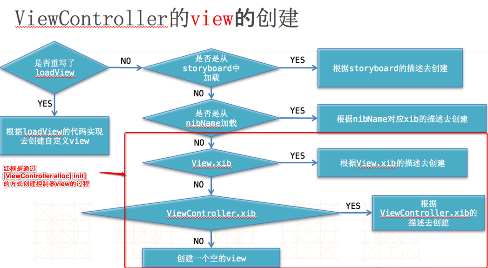

### Size Classes 具体使用
- 对屏幕进行分类

### UIView和CALayer是什么关系?
- UIView显示在屏幕上归功于CALayer，通过调用drawRect方法来渲染自身的内容，调节CALayer属性可以调整UIView的外观，UIView继承自UIResponder，比起CALayer可以响应用户事件，Xcode6之后可以方便的通过视图调试功能查看图层之间的关系
- UIView是iOS系统中界面元素的基础，所有的界面元素都继承自它。它内部是由Core Animation来实现的，它真正的绘图部分，是由一个叫CALayer(Core Animation Layer)的类来管理。UIView本身，更像是一个CALayer的管理器，访问它的跟绘图和坐标有关的属性，如frame，bounds等，实际上内部都是访问它所在CALayer的相关属性
- UIView有个layer属性，可以返回它的`主CALayer实例`，UIView有一个`layerClass`方法，返回`主layer所使用的类`，UIView的子类，可以通过重载这个方法，来让UIView使用不同的CALayer来显示，如：

```objc
- (class) layerClass {
    // 使某个UIView的子类使用GL来进行绘制
    return ([CAEAGLLayer class]);
}
```
- UIView的CALayer类似UIView的子View树形结构，也可以向它的layer上添加子layer，来完成某些特殊的显示。例如下面的代码会在目标View上敷上一层黑色的透明薄膜。

```objc
grayCover = [[CALayer alloc]init];
grayCover.backgroudColor = [[UIColor blackColor]colorWithAlphaComponent:0.2].CGColor;
[self.layer addSubLayer:grayCover];
```
- 补充部分，这部分有深度了，大致了解一下吧，UIView的layer树形在系统内部被系统维护着`三份`copy
    - 逻辑树，就是代码里可以操纵的，例如更改layer的属性等等就在这一份
    - 动画树，这是一个中间层，系统正是在这一层上更改属性，进行各种渲染操作
    - 显示树，这棵树的内容是当前正被显示在屏幕上的内容
    - 这三棵树的逻辑结构都是一样的，区别只有各自的属性

### loadView的作用？
- loadView用来自定义view，只要实现了这个方法，其他通过xib或storyboard创建的view都不会被加载
- 看懂控制器view创建的这个图就行


### IBOutlet连出来的视图属性为什么可以被设置成weak?
- 因为父控件的subViews数组已经对它有一个强引用

### IB中User Defined Runtime Attributes如何使用？
- User Defined Runtime Attributes是一个不被看重但功能非常强大的的特性，它能够通过KVC的方式配置一些你在interface builder中不能配置的属性
- 当你希望在IB中作尽可能多得事情，这个特性能够帮助你编写更加轻量级的viewcontroller

### 沙盒目录结构是怎样的？各自用于那些场景？
- Application：存放程序源文件，上架前经过数字签名，上架后不可修改
- Documents：常用目录，iCloud`备份`目录，存放数据
- Library
    - Caches：存放体积大又不需要备份的数据
    - Preference：设置目录，iCloud会`备份`设置信息
- tmp：存放临时文件，不会被备份，而且这个文件下的数据有可能`随时`被清除的可能

### pushViewController和presentViewController有什么区别
- 两者都是在多个试图控制器间跳转的函数
- presentViewController提供的是一个模态视图控制器(modal)
- pushViewController提供一个`栈`控制器数组，push/pop

### 请简述UITableView的复用机制
- 每次创建cell的时候通过dequeueReusableCellWithIdentifier:方法创建cell，它先到缓存池中找指定标识的cell，如果没有就直接返回nil
- 如果没有找到指定标识的cell，那么会通过initWithStyle:reuseIdentifier:创建一个cell
- 当cell离开界面就会被放到缓存池中，以供下次复用

### 如何高性能的给 UIImageView 加个圆角?
- 不好的解决方案
    - 使用下面的方式会`强制Core Animation提前渲染屏幕的离屏绘制, 而离屏绘制就会给性能带来负面影响`，会有卡顿的现象出现

    ```objc
    self.view.layer.cornerRadius = 5;
    self.view.layer.masksToBounds = YES;
    ```

- 正确的解决方案：使用绘图技术

```objc
- (UIImage *)circleImage
{
    // NO代表透明
    UIGraphicsBeginImageContextWithOptions(self.size, NO, 0.0);

    // 获得上下文
    CGContextRef ctx = UIGraphicsGetCurrentContext();

    // 添加一个圆
    CGRect rect = CGRectMake(0, 0, self.size.width, self.size.height);
    CGContextAddEllipseInRect(ctx, rect);

    // 裁剪
    CGContextClip(ctx);

    // 将图片画上去
    [self drawInRect:rect];

    UIImage *image = UIGraphicsGetImageFromCurrentImageContext();

    // 关闭上下文
    UIGraphicsEndImageContext();

    return image;
}
```

- 还有一种方案：使用了贝塞尔曲线"切割"个这个图片, 给UIImageView 添加了的圆角，其实也是通过绘图技术来实现的

```objc
UIImageView *imageView = [[UIImageView alloc] initWithFrame:CGRectMake(0, 0, 100, 100)];
imageView.center = CGPointMake(200, 300);
UIImage *anotherImage = [UIImage imageNamed:@"image"];
UIGraphicsBeginImageContextWithOptions(imageView.bounds.size, NO, 1.0);
[[UIBezierPath bezierPathWithRoundedRect:imageView.bounds
                       cornerRadius:50] addClip];
[anotherImage drawInRect:imageView.bounds];
imageView.image = UIGraphicsGetImageFromCurrentImageContext();
UIGraphicsEndImageContext();
[self.view addSubview:imageView];
```

### 使用drawRect有什么影响？
- drawRect方法依赖Core Graphics框架来进行自定义的绘制
- `缺点：`它处理touch事件时每次按钮被点击后，都会用setNeddsDisplay进行强制重绘；而且`不止一次`，每次`单点事件触发两次执行`。这样的话从性能的角度来说，对CPU和内存来说都是欠佳的。特别是如果在我们的界面上有多个这样的UIButton实例，那就会很糟糕了
- 这个方法的调用机制也是非常特别. 当你调用 setNeedsDisplay 方法时, UIKit 将会把当前图层标记为dirty,但还是会显示原来的内容,直到下一次的视图渲染周期,才会将标记为 dirty 的图层重新建立Core Graphics上下文,然后将内存中的数据恢复出来, 再使用 CGContextRef 进行绘制

### 描述下SDWebImage里面给UIImageView加载图片的逻辑
- SDWebImage 中为 UIImageView 提供了一个分类`UIImageView+WebCache.h`, 这个分类中有一个最常用的接口`sd_setImageWithURL:placeholderImage:`，会在真实图片出现前会先显示占位图片，当真实图片被加载出来后在替换占位图片
- 加载图片的过程大致如下：
    - 首先会在 SDWebImageCache 中寻找图片是否有对应的缓存, 它会以url 作为数据的索引先在内存中寻找是否有对应的缓存
    - 如果缓存未找到就会利用通过MD5处理过的key来继续在磁盘中查询对应的数据, 如果找到了, 就会把磁盘中的数据加载到内存中，并将图片显示出来
    - 如果在内存和磁盘缓存中都没有找到，就会向远程服务器发送请求，开始下载图片
    - 下载后的图片会加入缓存中，并写入磁盘中
    - 整个获取图片的过程都是在子线程中执行，获取到图片后回到主线程将图片显示出来

### 设计个简单的图片内存缓存器
- 类似上面SDWebImage实现原理即可
- 一定要有`移除策略`：释放数据模型对象

### 控制器的生命周期
- 就是问的view的生命周期，下面已经按方法执行顺序进行了排序

```objc
// 自定义控制器view，这个方法只有实现了才会执行
- (void)loadView
{
    self.view = [[UIView alloc] init];
    self.view.backgroundColor = [UIColor orangeColor];
}
// view是懒加载，只要view加载完毕就调用这个方法
- (void)viewDidLoad
{
    [super viewDidLoad];

    NSLog(@"%s",__func__);
}

// view即将显示
- (void)viewWillAppear:(BOOL)animated
{
    [super viewWillAppear:animated];

    NSLog(@"%s",__func__);
}
// view即将开始布局子控件
- (void)viewWillLayoutSubviews
{
    [super viewWillLayoutSubviews];

    NSLog(@"%s",__func__);
}
// view已经完成子控件的布局
- (void)viewDidLayoutSubviews
{
    [super viewDidLayoutSubviews];

    NSLog(@"%s",__func__);
}
// view已经出现
- (void)viewDidAppear:(BOOL)animated
{
    [super viewDidAppear:animated];

    NSLog(@"%s",__func__);
}
// view即将消失
- (void)viewWillDisappear:(BOOL)animated
{
    [super viewWillDisappear:animated];

    NSLog(@"%s",__func__);
}
// view已经消失
- (void)viewDidDisappear:(BOOL)animated
{
    [super viewDidDisappear:animated];

    NSLog(@"%s",__func__);
}
// 收到内存警告
- (void)didReceiveMemoryWarning
{
    [super didReceiveMemoryWarning];

    NSLog(@"%s",__func__);
}
// 方法已过期，即将销毁view
- (void)viewWillUnload
{

}
// 方法已过期，已经销毁view
- (void)viewDidUnload
{

}
```

### 你是怎么封装一个view的
- 可以通过纯代码或者xib的方式来封装子控件
- 建立一个跟view相关的模型，然后将模型数据传给view，通过模型上的数据给view的子控件赋值

```objc
/**
 *  纯代码初始化控件时一定会走这个方法
 */
- (instancetype)initWithFrame:(CGRect)frame
{
    if(self = [super initWithFrame:frame])
    {
        [self setup];
    }

    return self;
}

/**
 *  通过xib初始化控件时一定会走这个方法
 */
- (id)initWithCoder:(NSCoder *)aDecoder
{
    if(self = [super initWithCoder:aDecoder])
    {
        [self setup];
    }

    return self;
}

- (void)setup
{
    // 初始化代码
}
```

### 如何进行iOS6、7的适配
- 通过判断版本来控制，来执行响应的代码
- 功能适配：保证同一个功能在6、7上都能用
- UI适配：保证各自的显示风格

```objc
// iOS版本为7.0以上（包含7.0）
#define iOS7 ([[UIDevice currentDevice].systemVersion doubleValue]>=7.0)
```

### 如何渲染UILabel的文字？
- 通过NSAttributedString/NSMutableAttributedString（富文本）

### UIScrollView的contentSize能否在viewDidLoad中设置？
- `能`
- 因为UIScrollView的内容尺寸是根据其内部的内容来决定的，所以是可以在viewDidLoad中设置的
- 补充：（这仅仅是一种特殊情况）
    - 前提，控制器B是控制器A的一个子控制器，且控制器B的内容只在控制器A的view的部分区域中显示
    - 假设控制器B的view中有一个UIScrollView这样一个子控件
    - 如果此时在控制器B的viewDidLoad中设置UIScrollView的contentSize的话会导致不准确的问题
    - 因为任何控制器的view在viewDidLoad的时候的尺寸都是不准确的，如果有子控件的尺寸依赖父控件的尺寸，在这个方法中设置会导致子控件的frame不准确，所以这时应该在下面的方法中设置子控件的尺寸

```objc
-(void)viewDidLayoutSubviews;
```

### 触摸事件的传递
- 触摸事件的传递是从父控件传递到子控件
- 如果父控件不能接收触摸事件，那么子控件就不可能接收到触摸事件
- 不能接受触摸事件的四种情况
    - 不接收用户交互，即：userInteractionEnabled = NO
    - 隐藏，即：hidden = YES
    - 透明，即：alpha <= 0.01
    - 未启用，即：enabled = NO
- `提示：`UIImageView的userInteractionEnabled`默认就是NO`，因此UIImageView以及它的子控件默认是不能接收触摸事件的
- 如何找到最合适处理事件的控件：
   - 首先，判断自己`能否`接收触摸事件
       - 可以通过重写hitTest:withEvent:方法验证
   - 其次，判断触摸点`是否在`自己身上
       - 对应方法pointInside:withEvent:
   - 从后往前(`先遍历最后添加的子控件`)遍历子控件，重复前面的两个步骤
   - 如果没有符合条件的子控件，那么就自己处理

### 事件响应者链
- 如果当前view是控制器的view，那么就传递给控制器
- 如果控制器不存在，则将其传递给它的父控件
- 在视图层次结构的最顶层视图也不能处理接收到的事件或消息，则将事件或消息传递给UIWindow对象进行处理
- 如果UIWindow对象也不处理，则将事件或消息传递给UIApplication对象
- 如果UIApplication也不能处理该事件或消息，则将其`丢弃`
- 补充：如何判断上一个响应者
    - 如果当前这个view是控制器的view，那么`控制器`就是上一个响应者
    - 如果当前这个view不是控制器的view，那么`父控件`就是上一个响应者


### 如何实现类似QQ的三角形头像
- Quartz2D
- 使用coreGraphics裁剪出一个三角形

### 核心动画里包含什么？
- 基本动画
- 回头自己总结吧

### 如何使用核心动画？
- 创建
- 设置相关属性
- 添加到CALayer上，会自动执行动画


