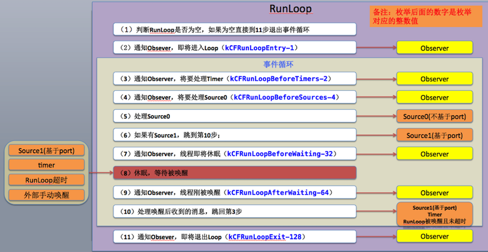

### runtime怎么添加属性、方法等
- ivar表示成员变量
- class_addIvar
- class_addMethod
- class_addProperty
- class_addProtocol
- class_replaceProperty

### 是否可以把比较耗时的操作放在NSNotificationCenter中
- 首先必须`明确通知在哪个线程中发出`，那么处理接受到通知的方法也在这个线程中调用
- 如果在`异步`线程发的通知，那么`可以`执行比较耗时的操作；
- 如果在`主线程`发的通知，那么就`不可以`执行比较耗时的操作

### runtime 如何实现 weak 属性
- 首先要搞清楚weak属性的特点

```objc
weak策略表明该属性定义了一种“非拥有关系” (nonowning relationship)。
为这种属性设置新值时，设置方法既不保留新值，也不释放旧值。此特质同assign类似;
然而在属性所指的对象遭到摧毁时，属性值也会清空(nil out)
```
- 那么runtime如何实现weak变量的自动置nil？

```objc
runtime对注册的类，会进行布局，会将 weak 对象放入一个 hash 表中。
用 weak 指向的对象内存地址作为 key，当此对象的引用计数为0的时候会调用对象的 dealloc 方法，
假设 weak 指向的对象内存地址是a，那么就会以a为key，在这个 weak hash表中搜索，找到所有以a为key的 weak 对象，从而设置为 nil。
```

### weak属性需要在dealloc中置nil么
- 在ARC环境无论是强指针还是弱指针都无需在 dealloc 设置为 nil ， ARC 会自动帮我们处理
- 即便是编译器不帮我们做这些，weak也不需要在dealloc中置nil
- 在属性所指的对象遭到摧毁时，属性值也会清空

```objc
// 模拟下weak的setter方法，大致如下
- (void)setObject:(NSObject *)object
{
    objc_setAssociatedObject(self, "object", object, OBJC_ASSOCIATION_ASSIGN);
    [object cyl_runAtDealloc:^{
        _object = nil;
    }];
}
```

### 一个Objective-C对象如何进行内存布局？（考虑有父类的情况）
- 所有`父类的`成员变量和`自己的`成员变量都会存放在该对象所对应的存储空间中
- 父类的方法和自己的方法都会缓存在类对象的方法缓存中，类方法是缓存在元类对象中
- 每一个对象内部都有一个`isa指针`,指向他的`类对象`,类对象中存放着本对象的如下信息
    - 对象方法列表
    - 成员变量的列表
    - 属性列表
- 每个 Objective-C 对象都有相同的结构，如下图所示

| Objective-C 对象的结构图 |
| -- |
| ISA指针 |
| 根类(NSObject)的实例变量|
| 倒数第二层父类的实例变量 |
| ... |
| 父类的实例变量|
| 类的实例变量 |

- 根类对象就是NSObject，它的super class指针指向nil
- 类对象既然称为对象，那它也是一个实例。类对象中也有一个isa指针指向它的元类(meta class)，即类对象是元类的实例。元类内部存放的是`类方法`列表，`根元类的isa指针指向自己，superclass指针指向NSObject类`


### 一个objc对象的isa的指针指向什么？有什么作用？
- 每一个对象内部都有一个isa指针，这个指针是指向它的真实类型
- 根据这个指针就能知道将来调用哪个类的方法

### 下面的代码输出什么？
```objc
@implementation Son : Father
- (id)init
{
    self = [super init];
    if (self) {
        NSLog(@"%@", NSStringFromClass([self class]));
        NSLog(@"%@", NSStringFromClass([super class]));
    }
    return self;
}
@end
```
- 答案：都输出 Son
- 这个题目主要是考察关于objc中对 self 和 super 的理解：
    - self 是类的隐藏参数，指向当前调用方法的这个类的实例。而 super 本质是一个`编译器标示符`，和 self 是指向的同一个消息接受者
    - 当使用 self 调用方法时，会从`当前类`的方法列表中开始找，`如果没有`，就从`父类中再找`；
    - 而当使用 super时，则从父类的方法列表中开始找。然后调用父类的这个方法
    - 调用[self class] 时，会转化成 objc_msgSend函数

    ```objc
    id objc_msgSend(id self, SEL op, ...)
    ```

    - 调用 [super class]时，会转化成 objc_msgSendSuper函数

    ```objc
    id objc_msgSendSuper(struct objc_super *super, SEL op, ...)
    ```

    - 第一个参数是 `objc_super` 这样一个结构体，其定义如下

    ```objc
    struct objc_super {
        __unsafe_unretained id receiver;
        __unsafe_unretained Class super_class;
    };
    ```
    - 第一个成员是 receiver, 类似于上面的 objc_msgSend函数第一个参数self
    - 第二个成员是记录当前类的父类是什么，告诉程序从父类中开始找方法，找到方法后，最后内部是使用 objc_msgSend(objc_super->receiver, @selector(class))去调用， 此时已经和[self class]调用相同了，故上述输出结果仍然返回 Son
    - objc Runtime开源代码对- (Class)class方法的实现

    ```objc
    -(Class)class {
        return object_getClass(self);
    }
    ```

### runtime如何通过selector找到对应的IMP地址？（分别考虑类方法和实例方法）
- 每一个类对象中都一个对象方法列表（对象方法缓存）
- 类方法列表是存放在类对象中isa指针指向的元类对象中（类方法缓存）
- 方法列表中每个方法结构体中记录着方法的`名称`,`方法实现`,以及`参数类型`，其实selector本质就是方法名称,通过这个方法名称就可以在方法列表中找到对应的方法实现.
- 当我们发送一个消息给一个NSObject对象时，这条消息会在对象的类对象方法列表里查找
- 当我们发送一个消息给一个类时，这条消息会在类的Meta Class对象的方法列表里查找

### objc中的类方法和实例方法有什么本质区别和联系
- 类方法：
    - 类方法是属于类对象的
    - 类方法只能通过类对象调用
    - 类方法中的self是类对象
    - 类方法可以调用其他的类方法
    - 类方法中`不能`访问成员变量
    - 类方法中`不能`直接调用对象方法
    - 类方法是存储在元类对象的方法缓存中
- 实例方法：
    - 实例方法是属于实例对象的
    - 实例方法只能通过实例对象调用
    - 实例方法中的self是实例对象
    - 实例方法中可以访问成员变量
    - 实例方法中直接调用实例方法
    - 实例方法中`可以调用类方法(通过类名)`
    - 实例方法是存放在类对象的方法缓存中

### 使用`runtime Associate`方法关联的对象，需要在主对象dealloc的时候释放么？
- 无论在MRC下还是ARC下`均不需要`
- 被关联的对象在生命周期内要比对象本身释放的`晚很多`，它们会在被 NSObject -dealloc 调用的 `object_dispose()`方法中释放
- 补充：对象的内存销毁时间表，分四个步骤

```objc
1.调用 -release ：引用计数变为零
 * 对象正在被销毁，生命周期即将结束.
 * 不能再有新的 __weak 弱引用，否则将指向 nil.
 * 调用 [self dealloc]
2. 父类调用 -dealloc
 * 继承关系中最直接继承的父类再调用 -dealloc
 * 如果是 MRC 代码 则会手动释放实例变量们（iVars）
 * 继承关系中每一层的父类 都再调用 -dealloc
3. NSObject 调 -dealloc
 * 只做一件事：调用 Objective-C runtime 中的 object_dispose() 方法
4. 调用 object_dispose()
 * 为 C++ 的实例变量们（iVars）调用 destructors
 * 为 ARC 状态下的 实例变量们（iVars） 调用 -release
 * 解除所有使用 runtime Associate方法关联的对象
 * 解除所有 __weak 引用
 * 调用 free()
```

### _objc_msgForward函数是做什么的？直接调用它将会发生什么？
- _objc_msgForward是IMP类型，用于消息转发的：当向一个对象发送一条消息，但它并没有实现的时候，_objc_msgForward会尝试做消息转发
- 直接调用_objc_msgForward是`非常危险`的事，这是把双刃刀，如果用不好会直接导致程序Crash，但是如果用得好，能做很多非常酷的事
- [JSPatch](https://github.com/bang590/JSPatch)就是直接调用_objc_msgForward来实现其核心功能的
- [详细解说](https://github.com/ChenYilong/iOSInterviewQuestions/blob/master/01%E3%80%8A%E6%8B%9B%E8%81%98%E4%B8%80%E4%B8%AA%E9%9D%A0%E8%B0%B1%E7%9A%84iOS%E3%80%8B%E9%9D%A2%E8%AF%95%E9%A2%98%E5%8F%82%E8%80%83%E7%AD%94%E6%A1%88/%E3%80%8A%E6%8B%9B%E8%81%98%E4%B8%80%E4%B8%AA%E9%9D%A0%E8%B0%B1%E7%9A%84iOS%E3%80%8B%E9%9D%A2%E8%AF%95%E9%A2%98%E5%8F%82%E8%80%83%E7%AD%94%E6%A1%88%EF%BC%88%E4%B8%8B%EF%BC%89.md)参见这里的第一个问题解答

### 能否向编译后得到的类中增加`实例变量`？能否向运行时创建的类中添加`实例变量`？为什么？
- `不能`向编译后得到的类中增加`实例变量`；
- `能`向运行时创建的类中添加`实例变量`；
- 分析如下：
    - 因为编译后的类已经注册在runtime中，类结构体中的objc_ivar_list 实例变量的链表和instance_size实例变量的内存大小已经确定，同时runtime 会调用class_setIvarLayout 或 class_setWeakIvarLayout来处理strong weak引用，所以`不能`向存在的类中添加`实例变量`
    - 运行时创建的类是`可以`添加`实例变量`，调用 class_addIvar函数，但是得在调用objc_allocateClassPair`之后`，objc_registerClassPair`之前`，原因同上。

### runloop和线程有什么关系？
- 每条线程都有`唯一`的一个RunLoop对象与之对应的
- 主线程的RunLoop是`自动创建并启动`
- 子线程的RunLoop需要`手动创建`
- 子线程的RunLoop创建步骤如下：
    - 在子线程中调用[NSRunLoop currentRunLoop]创建RunLoop对象（`懒加载，只创建一次`）
    - 获得RunLoop对象后要调用`run`方法来启动一个运行循环

    ```objc
    // 启动RunLoop
    [[NSRunLoop currentRunLoop] run];
    ```

    - RunLoop的其他启动方法

    ```objc
    // 第一个参数：指定运行模式
    // 第二个参数：指定RunLoop的过期时间，即：到了这个时间后RunLoop就失效了
    [[NSRunLoop currentRunLoop] runMode:kCFRunLoopDefaultMode beforeDate:[NSDate distantFuture]];
    ```

### runloop的mode作用是什么？
- 用来控制一些特殊操作只能在指定模式下运行，一般可以通过指定操作的运行mode来控制执行时机，以提高用户体验
- 系统默认注册了5个Mode
    - `kCFRunLoopDefaultMode`：App的`默认Mode`，`通常主线程`是在这个Mode下运行，对应OC中的：`NSDefaultRunLoopMode`
    - `UITrackingRunLoopMode`：`界面跟踪` Mode，用于 ScrollView 追踪触摸滑动，保证界面滑动时不受其他Mode影响
    - `kCFRunLoopCommonModes`:这是一个`标记`Mode，不是一种真正的Mode，事件可以运行在所有标有common modes标记的模式中，对应OC中的`NSRunLoopCommonModes`，带有common modes标记的模式有：UITrackingRunLoopMode和kCFRunLoopDefaultMode
    - UIInitializationRunLoopMode：在`启动` App时进入的第一个 Mode，`启动完成后就不再使用`
    - GSEventReceiveRunLoopMode：接受系统事件的内部Mode，通常用不到

### 以+scheduledTimerWithTimeInterval...的方式触发的timer，在滑动页面上的列表时，timer会暂定回调，为什么？如何解决？
- 这里强调一点：在主线程中以+scheduledTimerWithTimeInterval...的方式触发的timer默认是运行在`NSDefaultRunLoopMode`模式下的，当滑动页面上的列表时，进入了`UITrackingRunLoopMode`模式，这时候timer就会停止
- 可以修改timer的运行模式为`NSRunLoopCommonModes`，这样定时器就可以一直运行了

- 以下是我的笔记补充：
    - 在`子线程`中通过`scheduledTimerWithTimeInterval:...方法`来构建NSTimer
        - 方法内部已经创建NSTimer对象，并加入到RunLoop中，运行模式为NSDefaultRunLoopMode
        - 由于Mode有timer对象，所以RunLoop就开始监听定时器事件了，从而开始进入运行循环
        - 这个方法`仅仅`是创建RunLoop对象，并`不会`主动启动RunLoop，需要再`调用run方法`来启动
    - 如果在`主线程`中通过`scheduledTimerWithTimeInterval:...方法`来构建NSTimer，就不需要主动启动RunLoop对象，因为主线程的RunLoop对象在程序运行起来就已经被启动了

    ```objc
    // userInfo参数：用来给NSTimer的userInfo属性赋值，userInfo是只读的，只能在构建NSTimer对象时赋值
    [NSTimer scheduledTimerWithTimeInterval:1.0 target:self selector:@selector(run:) userInfo:@"ya了个hoo" repeats:YES];

    // scheduledTimer...方法创建出来NSTimer虽然已经指定了默认模式，但是【允许你修改模式】
    [[NSRunLoop currentRunLoop] addTimer:timer forMode:NSRunLoopCommonModes];

    // 【仅在子线程】需要手动启动RunLoop对象，进入运行循环
    [[NSRunLoop currentRunLoop] run];
    ```

### 猜想runloop内部是如何实现的？
- 从字面意思看：运行循环、跑圈；
- **`本质：`**内部就是`do-while循环`，在这个循环内部不断地处理各种事件(任务)，比如：Source、Timer、Observer；
- 每条线程都有`唯一`一个RunLoop对象与之对应，主线程的RunLoop默认已经启动，子线程的RunLoop需要`手动启动`；
- 每次RunLoop启动时，`只能`指定其中一个 Mode，这个Mode被称作 CurrentMode，如果需要切换Mode，只能`退出`Loop，再`重新指定`一个Mode进入，这样做主要是为了隔离不同Mode中的Source、Timer、Observer，让其互不影响；
- 附上RunLoop的运行图


### 不手动指定autoreleasepool的前提下，一个autorealese对象在什么时刻释放？（比如在一个vc的viewDidLoad中创建）
- 分两种情况：`手动干预`释放时机、`系统自动`去释放
    - 手动干预释放时机：指定autoreleasepool就是所谓的：当前作用域大括号结束时就立即释放
    - 系统自动去释放：不手动指定autoreleasepool，Autorelease对象会在当前的 runloop 迭代结束时释放，下面详细说明释放时机
        - RunLoop中的`三个状态`会处理自动释放池，通过打印代码发现有两个Observer监听到状态值为：1和160（32+128）
            - `kCFRunLoopEntry(1)` // 第一次进入会`创建`一个自动释放池
            - `kCFRunLoopBeforeWaiting(32)` // 进入休眠状态前`先销毁`自动释放池，`再创建`一个`新`的自动释放池
            - `kCFRunLoopExit(128)` // 退出RunLoop时`销毁`最后一次创建的自动释放池
- 如果在一个vc的viewDidLoad中创建一个Autorelease对象，那么该对象会在 viewDidAppear 方法执行前就被销毁了（是这样的吗？？？）

### 苹果是如何实现autoreleasepool的？
- autoreleasepool以一个队列数组的形式实现,主要通过下列三个函数完成.

```objc
objc_autoreleasepoolPush
objc_autoreleasepoolPop
objc_aurorelease
```
- 看函数名就可以知道，对autorelease分别执行push，和pop操作。销毁对象时执行release操作

### GCD的队列（dispatch_queue_t）分哪两种类型？背后的线程模型是什么样的？
- 串行队列
- 并行队列
- dispatch_global_queue();是全局并发队列
- dispatch_main_queue();是一种特殊串行队列
- 背后的线程模型：自定义队列 dispatch_queue_t queue; 可以自定义是并行：`DISPATCH_QUEUE_CONCURRENT` 或者 串行`DISPATCH_QUEUE_SERIAL`

### 苹果为什么要废弃dispatch_get_current_queue？
- 容易误用造成死锁

### 如何用GCD同步若干个异步调用？（如根据若干个url异步加载多张图片，然后在都下载完成后合成一张整图）
- 必须是`并发队列`才起作用
- 需求分析
    - 首先，分别`异步执行`2个耗时的操作
    - 其次，等2个异步操作都执行完毕后，再回到主线程执行一些操作
- 使用队列组实现上面的需求

```objc
// 创建队列组
dispatch_group_t group =  dispatch_group_create();

// 获取全局并发队列
dispatch_queue_t queue = dispatch_get_global_queue(DISPATCH_QUEUE_PRIORITY_DEFAULT, 0);

// 往队列组中添加耗时操作
dispatch_group_async(group, queue, ^{
    // 执行耗时的异步操作1
});

// 往队列组中添加耗时操作
dispatch_group_async(group, queue, ^{
    // 执行耗时的异步操作2
});

// 当并发队列组中的任务执行完毕后才会执行这里的代码
dispatch_group_notify(group, queue, ^{
    // 如果这里还有基于上面两个任务的结果继续执行一些代码，建议还是放到子线程中，等代码执行完毕后在回到主线程

    // 回到主线程
    dispatch_async(group, dispatch_get_main_queue(), ^{
        // 执行相关代码...
    });
});
```

### dispatch_barrier_async的作用是什么？
- 函数定义

```objc
dispatch_barrier_async(dispatch_queue_t queue, dispatch_block_t block);
```

- 必须是`并发`队列，要是串行队列，这个函数就没啥意义了
- `注意：`这个函数的第一个参数queue`不能`是全局的并发队列
- 作用：在它前面的任务执行结束后它才执行，在它后面的任务等它执行完成后才会执
- 示例代码

```objc
-(void)barrier
{
    dispatch_queue_t queue = dispatch_queue_create("12342234", DISPATCH_QUEUE_CONCURRENT);

    dispatch_async(queue, ^{
        NSLog(@"----1-----%@", [NSThread currentThread]);
    });
    dispatch_async(queue, ^{
        NSLog(@"----2-----%@", [NSThread currentThread]);
    });

    // 在它前面的任务执行结束后它才执行，在它后面的任务等它执行完成后才会执行
    dispatch_barrier_async(queue, ^{
        NSLog(@"----barrier-----%@", [NSThread currentThread]);
    });

    dispatch_async(queue, ^{
        NSLog(@"----3-----%@", [NSThread currentThread]);
    });
    dispatch_async(queue, ^{
        NSLog(@"----4-----%@", [NSThread currentThread]);
    });
}
```

### 以下代码运行结果如何？
```objc
- (void)viewDidLoad
{
    [super viewDidLoad];
    NSLog(@"1");
    dispatch_sync(dispatch_get_main_queue(), ^{
        NSLog(@"2");
    });
    NSLog(@"3");
}
```

- 答案：主线程死锁
