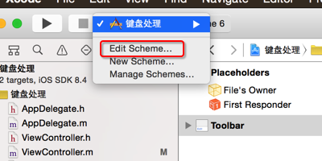
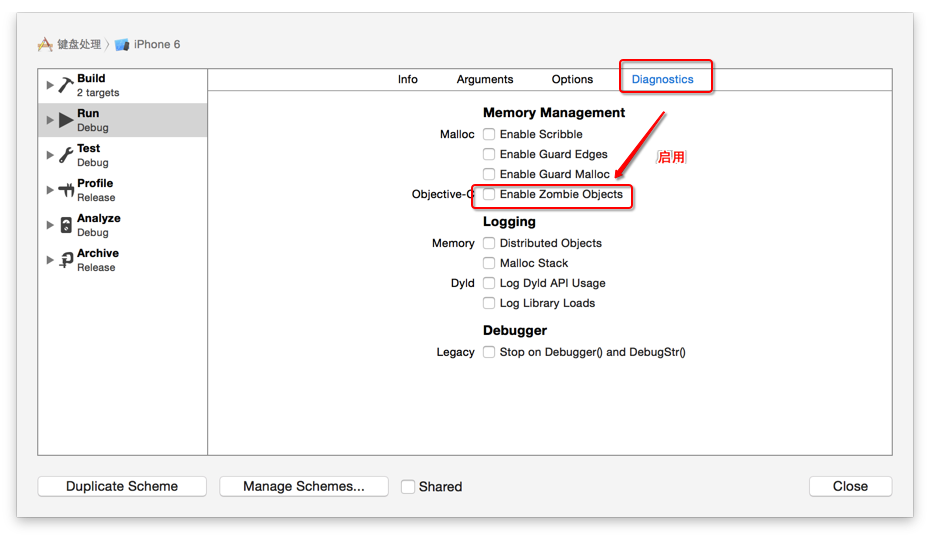
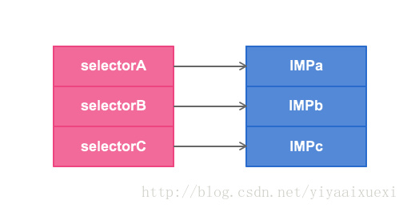

### lldb（gdb）常用的调试命令？
- po：打印对象，会调用对象description方法。是print-object的简写
- expr：可以在调试时动态执行指定表达式，并将结果打印出来，很有用的命令
- print：也是打印命令，需要指定类型
- bt：打印调用堆栈，是thread backtrace的简写，加all可打印所有thread的堆栈
- br l：是breakpoint list的简写

### BAD_ACCESS在什么情况下出现？
- 访问一个僵尸对象，访问僵尸对象的成员变量或者向其发消息
- 死循环

### 如何调试BAD_ACCESS错误
- 设置全局断点快速定位问题代码所在行
- 开启僵尸对象调试功能



### 简述下Objective-C中调用方法的过程（runtime）
- Objective-C是动态语言，每个方法在运行时会被动态转为消息发送，即：objc_msgSend(receiver, selector)，整个过程介绍如下：
    - objc在向一个对象发送消息时，runtime库会根据对象的isa指针找到该对象实际所属的类
    - 然后在该类中的方法列表以及其父类方法列表中寻找方法运行
    - 如果，在最顶层的父类（一般也就NSObject）中依然找不到相应的方法时，程序在运行时会挂掉并抛出异常unrecognized selector sent to XXX
    - 但是在这之前，objc的运行时会给出`三次`拯救程序崩溃的机会，这三次拯救程序奔溃的说明见问题《什么时候会报unrecognized selector的异常》中的说明
- 补充说明：Runtime 铸就了Objective-C 是动态语言的特性，使得C语言具备了面向对象的特性，在程序运行期创建，检查，修改类、对象及其对应的方法，这些操作都可以使用runtime中的对应方法实现。

### 什么是method swizzling（俗称黑魔法）
- 简单说就是进行方法交换
- 在Objective-C中调用一个方法，其实是向一个对象发送消息，查找消息的唯一依据是selector的名字。利用Objective-C的动态特性，可以实现在运行时偷换selector对应的方法实现，达到给方法挂钩的目的
- 每个类都有一个方法列表，存放着方法的名字和方法实现的映射关系，selector的本质其实就是方法名，IMP有点类似函数指针，指向具体的Method实现，通过selector就可以找到对应的IMP

- 交换方法的几种实现方式
    - 利用 method_exchangeImplementations 交换两个方法的实现
    - 利用 class_replaceMethod 替换方法的实现
    - 利用 method_setImplementation 来直接设置某个方法的IMP


### objc中向一个nil对象发送消息将会发生什么？
- 在Objective-C中向nil发送消息是完全有效的——只是在运行时不会有任何作用
    - 如果一个方法返回值是一个对象，那么发送给nil的消息将返回0(nil)
    - 如果方法返回值为指针类型，其指针大小为小于或者等于sizeof(void*)
    - float，double，long double 或者long long的整型标量，发送给nil的消息将返回0
    - 如果方法返回值为结构体,发送给nil的消息将返回0。结构体中各个字段的值将都是0
    - 如果方法的返回值不是上述提到的几种情况，那么发送给nil的消息的返回值将是未定义的
- 具体原因分析
    - objc是动态语言，每个方法在运行时会被动态转为消息发送，即：objc_msgSend(receiver, selector)
    - 为了方便理解这个内容，还是贴一个objc的源代码

    ```objc
    struct objc_class
    {
      // isa指针指向Meta Class，因为Objc的类的本身也是一个Object，
      // 为了处理这个关系，runtime就创造了Meta Class，
      // 当给类发送[NSObject alloc]这样消息时，实际上是把这个消息发给了Class Object
      Class isa OBJC_ISA_AVAILABILITY;
      #if !__OBJC2__
      Class super_class OBJC2_UNAVAILABLE; // 父类
      const char *name OBJC2_UNAVAILABLE; // 类名
      long version OBJC2_UNAVAILABLE; // 类的版本信息，默认为0
      long info OBJC2_UNAVAILABLE; // 类信息，供运行期使用的一些位标识
      long instance_size OBJC2_UNAVAILABLE; // 该类的实例变量大小
      struct objc_ivar_list *ivars OBJC2_UNAVAILABLE; // 该类的成员变量链表
      struct objc_method_list **methodLists OBJC2_UNAVAILABLE; // 方法定义的链表
      // 方法缓存，对象接到一个消息会根据isa指针查找消息对象，
      // 这时会在method Lists中遍历，
      // 如果cache了，常用的方法调用时就能够提高调用的效率。
      // 这个方法缓存只存在一份，不是每个类的实例对象都有一个方法缓存
      // 子类会在自己的方法缓存中缓存父类的方法，父类在自己的方法缓存中也会缓存自己的方法，而不是说子类就不缓存父类方法了
      struct objc_cache *cache OBJC2_UNAVAILABLE;
      struct objc_protocol_list *protocols OBJC2_UNAVAILABLE; // 协议链表
      #endif
      } OBJC2_UNAVAILABLE;
    ```
    - objc在向一个对象发送消息时，runtime库会根据对象的isa指针找到该对象实际所属的类，然后在该类中的方法列表以及其父类方法列表中寻找方法运行，然后再发送消息的时候，objc_msgSend方法不会返回值，所谓的返回内容都是具体调用时执行的。
    - 如果向一个nil对象发送消息，首先在寻找对象的isa指针时就是0地址返回了，所以不会出现任何错误


### objc中向一个对象发送消息[obj foo]和objc_msgSend()函数之间有什么关系？
- [obj foo];在objc动态编译时，会被转意为：objc_msgSend(obj, @selector(foo));

### 什么时候会报unrecognized selector的异常？
- 当调用该对象上某个方法,而该对象上没有实现这个方法的时候， 可以通过“消息转发”进行解决，如果还是不行就会报unrecognized selector异常
- objc是动态语言，每个方法在运行时会被动态转为消息发送，即：objc_msgSend(receiver, selector)，整个过程介绍如下：
    - objc在向一个对象发送消息时，runtime库会根据对象的isa指针找到该对象实际所属的类
    - 然后在该类中的方法列表以及其父类方法列表中寻找方法运行
    - 如果，在最顶层的父类中依然找不到相应的方法时，程序在运行时会挂掉并抛出异常unrecognized selector sent to XXX 。但是在这之前，objc的运行时会给出`三次`拯救程序崩溃的机会

- `三次`拯救程序崩溃的机会
    - Method resolution
        - objc运行时会调用`+resolveInstanceMethod:或者 +resolveClassMethod:`，让你有机会提供一个函数实现。
        - 如果你添加了函数并返回 `YES`，那运行时系统就会`重新启动`一次消息发送的过程
        - 如果 resolve 方法返回 NO ，运行时就会移到下一步，消息转发
    - Fast forwarding
        - 如果目标对象实现了`-forwardingTargetForSelector:`，Runtime 这时就会调用这个方法，给你把这个消息转发给其他对象的机会
        - 只要这个方法返回的`不是nil和self`，整个消息发送的过程就会被`重启`，当然发送的对象会变成你返回的那个对象。
        - 否则，就会继续Normal Fowarding。
        - 这里叫Fast，只是为了区别下一步的转发机制。因为这一步不会创建任何新的对象，但Normal forwarding转发会创建一个NSInvocation对象，相对Normal forwarding转发更快点，所以这里叫Fast forwarding
    - Normal forwarding
        - 这一步是Runtime最后一次给你挽救的机会。
        - 首先它会发送-methodSignatureForSelector:消息获得函数的参数和返回值类型。
        - 如果-methodSignatureForSelector:返回nil，Runtime则会发出-doesNotRecognizeSelector:消息，程序这时也就挂掉了。
        - 如果返回了一个函数签名，Runtime就会创建一个NSInvocation对象并发送-forwardInvocation:消息给目标对象

### HTTP协议中POST方法和GET方法有那些区别?
- GET用于向服务器请求数据，POST用于提交数据
- GET请求，请求参数拼接形式暴露在地址栏，而POST请求参数则放在请求体里面，因此GET请求不适合用于验证密码等操作
- GET请求的URL有长度限制，POST请求不会有长度限制

### 使用block时什么情况会发生引用循环，如何解决？

### 在block内如何修改block外部变量？

### 使用系统的某些block api（如UIView的block版本写动画时），是否也考虑循环引用问题？
- 系统的某些block api中，UIView的block版本写动画时`不需要`考虑，`但也有一些api 需要考虑`
- 以下这些使用方式`不会`引起循环引用的问题

```objc
[UIView animateWithDuration:duration animations:^
{ [self.superview layoutIfNeeded]; }];

[[NSOperationQueue mainQueue] addOperationWithBlock:^
{ self.someProperty = xyz; }];

[[NSNotificationCenter defaultCenter] addObserverForName:@"someNotification"
            object:nil
             queue:[NSOperationQueue mainQueue]
        usingBlock:^(NSNotification * notification)
        { self.someProperty = xyz; }];
```

- 但如果方法中的一些参数是 成员变量，那么可以造成循环引用，如 GCD 、NSNotificationCenter调用就要小心一点，比如 GCD 内部如果引用了 self，而且 GCD 的参数是 成员变量，则要考虑到循环引用，举例如下：
    - GCD
        - 分析：self-->_operationsQueue-->block-->self形成闭环，就造成了循环引用
    ```objc
    __weak __typeof__(self) weakSelf = self;
    dispatch_group_async(_operationsGroup, _operationsQueue, ^
    {
        [weakSelf doSomething];
        [weakSelf doSomethingElse];
    } );
    ```

    - NSNotificationCenter
        - 分析：self-->_observer-->block-->self形成闭环，就造成了循环引用

    ```objc
      __weak __typeof__(self) weakSelf = self;
      _observer = [[NSNotificationCenter defaultCenter]
      addObserverForName:@"testKey"
      object:nil
      queue:nil
      usingBlock:^(NSNotification *note){
          [weakSelf dismissModalViewControllerAnimated:YES];
      }];
    ```

### OC中常见的循环引用总结

